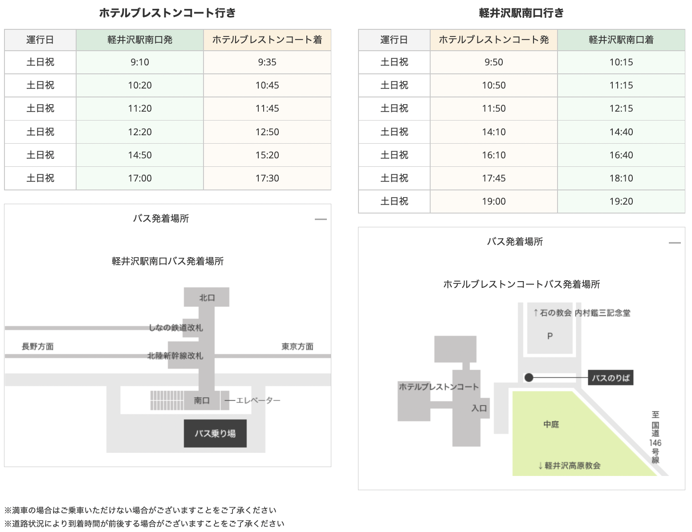
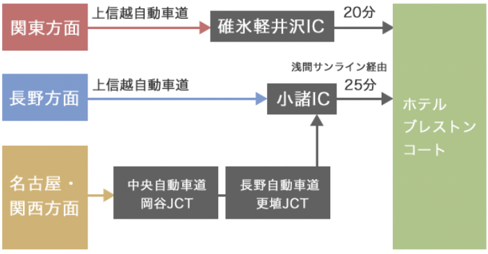

### 両家顔合わせ食事会

* 日程：2022/6/17（金）17:30
* 場所：[モデスト軽井沢](http://www.modesto.jp/)
* 服装：スマートカジュアル

<iframe src="https://www.google.com/maps/embed?pb=!1m14!1m8!1m3!1d12854.34125223825!2d138.590089!3d36.346599!3m2!1i1024!2i768!4f13.1!3m3!1m2!1s0x0%3A0xfd856839cfa9f537!2sMODESTO!5e0!3m2!1sja!2sus!4v1650806124665!5m2!1sja!2sus" style="border:0;" allowfullscreen="" loading="lazy" referrerpolicy="no-referrer-when-downgrade"></iframe>

### 挙式

* 日程：2022/6/18（土）11:30（集合：10:45）
* 場所：[石の教会](https://www.stonechurch.jp/)
* 会場住所：長野県安曇野市長野県北佐久郡軽井沢町永倉2144 星野リゾート 軽井沢ホテルブレストンコート
* 電話：[0267-46-6200](tel:0267-46-6200)
* HP：https://www.blestoncourt.com/wedding/

### 挙式集合時間・場所

ご多用中恐れ入りますが、ご臨席承りますようご案内申し上げます。
集合時間：10:45
集合場所：2F ご参列ロビー

### 美容・着付けについて

ホテルにてヘアセット・メイクのご用意も可能です。  
必要な場合はこちらで予約を取りますので１ヶ月月前までに私たちに連絡してください。

**場所**

ホテルブレストンコート B1F
[ホテル館内MAP参照](#ホテル館内MAP "ホテル館内MAP")

**着付け・ヘア・メイク料金**

| 内容 | 料金（税込） |
|:-----------|:------------|
|留袖着付け|11,000円|
|振袖着付け|14,300円|
|ヘア |7,700円|
|メイク|8,800円|

※お支度入りは挙式の2～3時間前のご案内となります。  
ご利用人数が多い場合、お客様の入室時間が異なります。

ご自身のお衣裳を事前に発送される場合は、挙式2日前必着で下記の住所までご送付ください。

**送付先**

〒389-0111  
長野県北佐久郡軽井沢町長倉2144  
軽井沢ホテルブレストンコート B1Fクローク参列衣裳係宛  
TEL [0267-46-6200](tel:0267-46-6200)
※お荷物の入った箱の表側（宅急便伝票「品名欄」など）に、挙式日・ご両家名・ご使用者のお名前・品名を明記してください。  
例：6月18日 山上・江口家 ご使用者名：長野 花子 品名：ドレス  

### 更衣室

ホテルB1Fに紳士用・婦人用の更衣室がございます。  
ご自由にご利用ください。

### お手荷物
貴重品以外のお手荷物はホテル1Fのクロークでお預けください。  
更衣室内にも簡易ロッカーの用意がございます。

### ホテル館内MAP

### アクセス

**電車でお越しの場合**

軽井沢駅南口より無料送迎バスが運行しております。  
シーズンや曜日によって時刻が異なりますので、[時刻表](https://www.blestoncourt.com/access/shuttlebus/)をご確認ください。

タクシーをご利用の場合

* 軽井沢駅から約15分（2,500円前後）
* 中軽井沢駅から約10分（1,000円前後）

**お車でお越しの場合**

ホテル専用の駐車場（無料）をご利用ください。  
予約は不要です。

### 軽井沢星野エリアMAP

その他ご不明点は下のリンクをご参照ください。
https://www.blestoncourt.com/wedding/guest/

